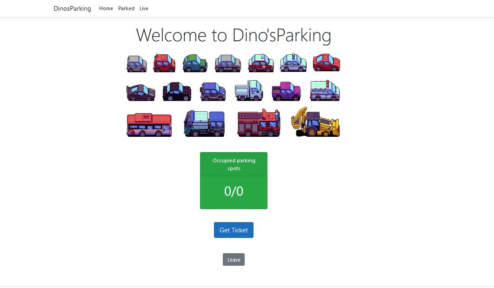
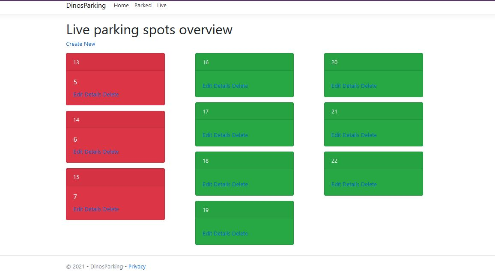
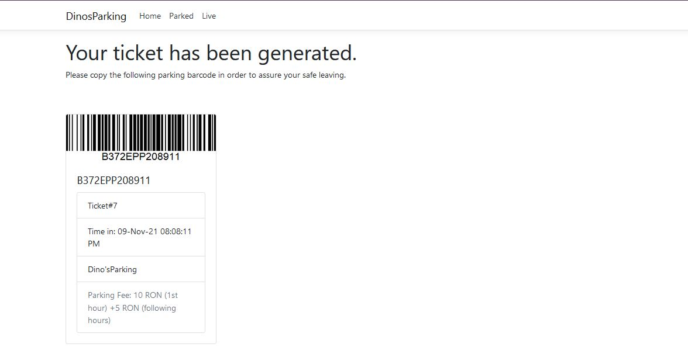
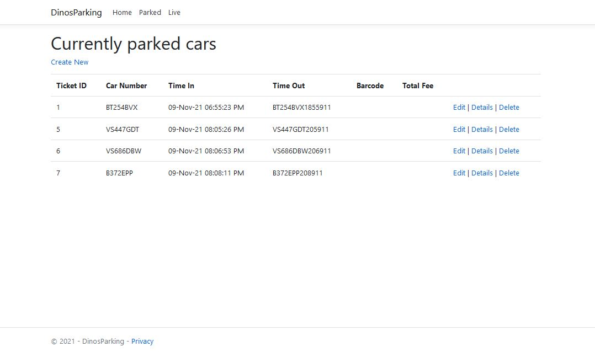
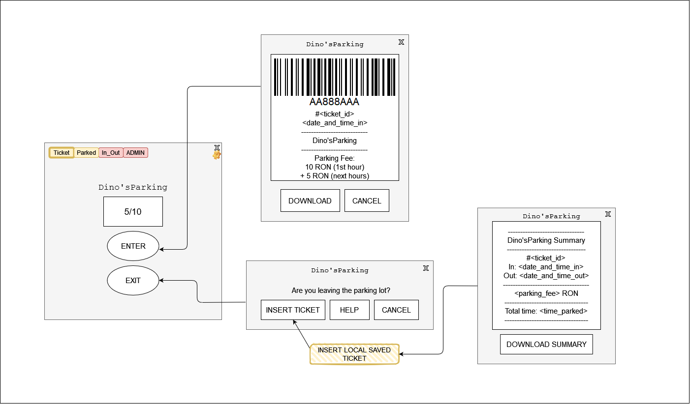
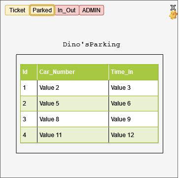

# DinosParking-CarParkingApp
## Current state
MVC
* Models:
  * Ticket
  * ParkingSpot
* Controllers:
  * HomeController
  * TicketsController
  * ParkingSpotsController
* Views:
  * Tickets
    * C.R.U.D. views
    * NewTicket
    * ScanTicket
  * ParkingSpots
    * C.R.U.D. views

## Initial state
> Main window
> * See available parking spots
> * Trigger ticket generation
> * Trigger summary generation

> Client parking overview
> * See currently parked cars

> Admin parking overview
> * Live visual representation of parking spots - occupied/available
