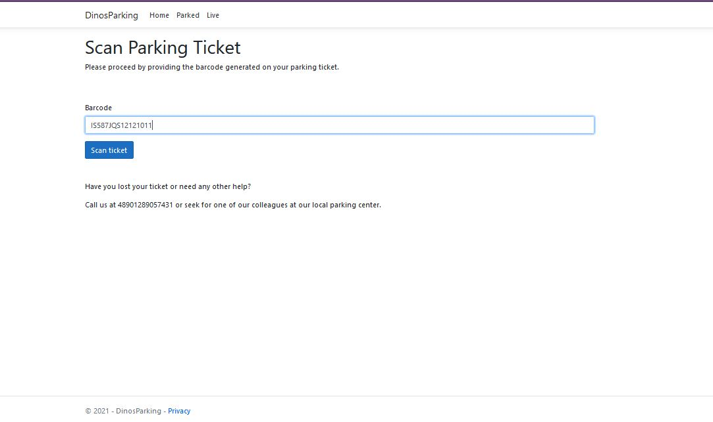

# DinosParking-CarParkingApp
## Current state
MVC
* Models:
  * Ticket
  * ParkingSpot
* Controllers:
  * HomeController
  * TicketsController
  * ParkingSpotsController
* Views:
  * Tickets
    * C.R.U.D. views
    * NewTicket
    * ScanTicket
    * NewSummary
  * ParkingSpots
    * C.R.U.D. views

App Overview

https://user-images.githubusercontent.com/22761407/141097344-54830d95-2801-460f-aa74-e81e973c861e.mp4

Flow overview

> New ticket

> Parking space updated

> Currently parked

> Home updated available parking

> Leaving park - Scan ticket

> Updated summary generation

## Initial state
> Main window
> * See available parking spots
> * Trigger ticket generation
> * Trigger summary generation

> Client parking overview
> * See currently parked cars

> Admin parking overview
> * Live visual representation of parking spots - occupied/available
